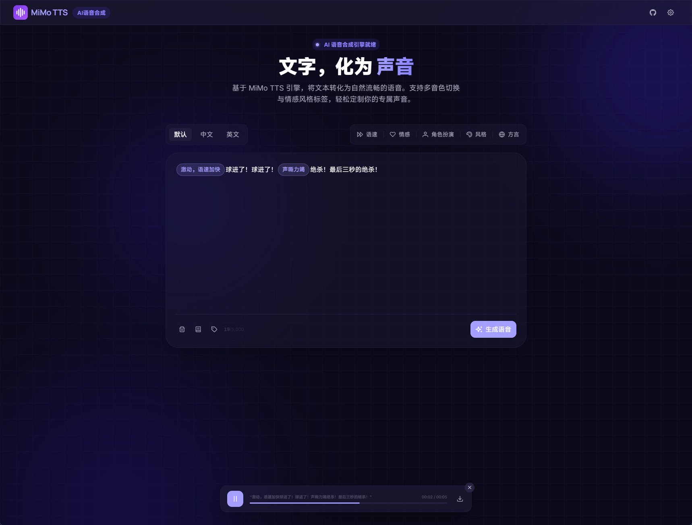

# MiMo TTS

一个基于 MiMo V2 TTS 模型的在线语音合成工具，支持多音色切换与情感风格标签控制。

演示站点：https://mimo-tts.meesii.com



## 技术栈

- Vue 3 + Vite
- Tailwind CSS 4
- PrimeVue 4
- Tiptap 3（富文本编辑）

## 快速开始

```bash
# 安装依赖
npm install

# 启动开发服务
npm run dev

# 构建生产版本
npm run build
```

启动后在页面右上角打开「模型设置」，填入你的 API Key 即可使用。

API Key 可在 [MiMo 开放平台](https://platform.xiaomimimo.com/) 获取。

## License

MIT
